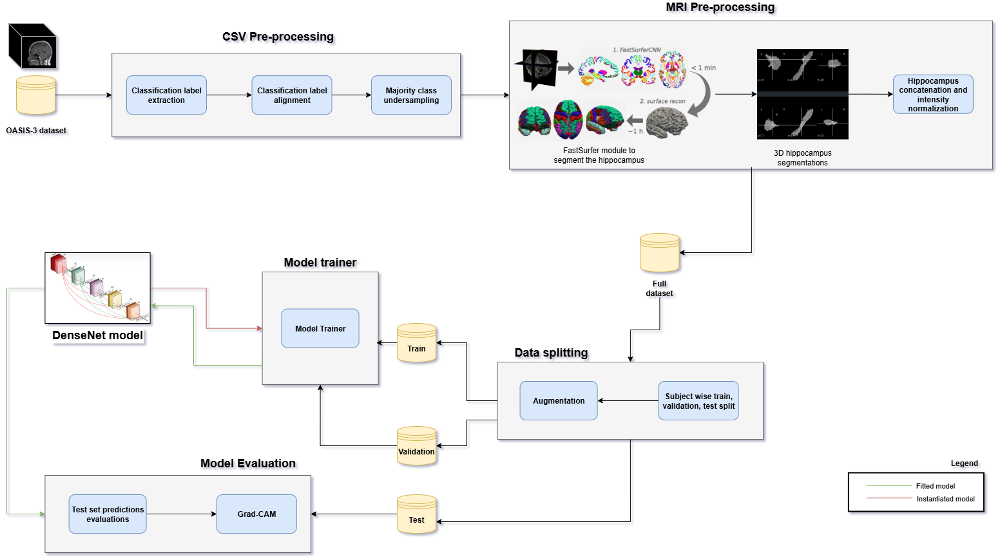
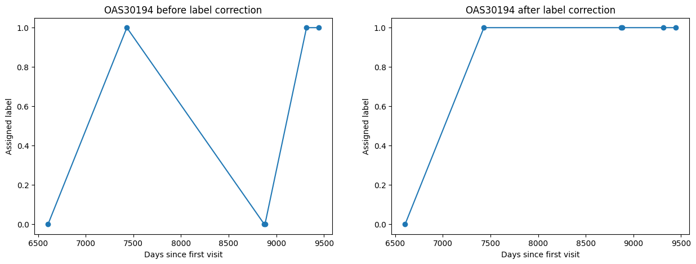
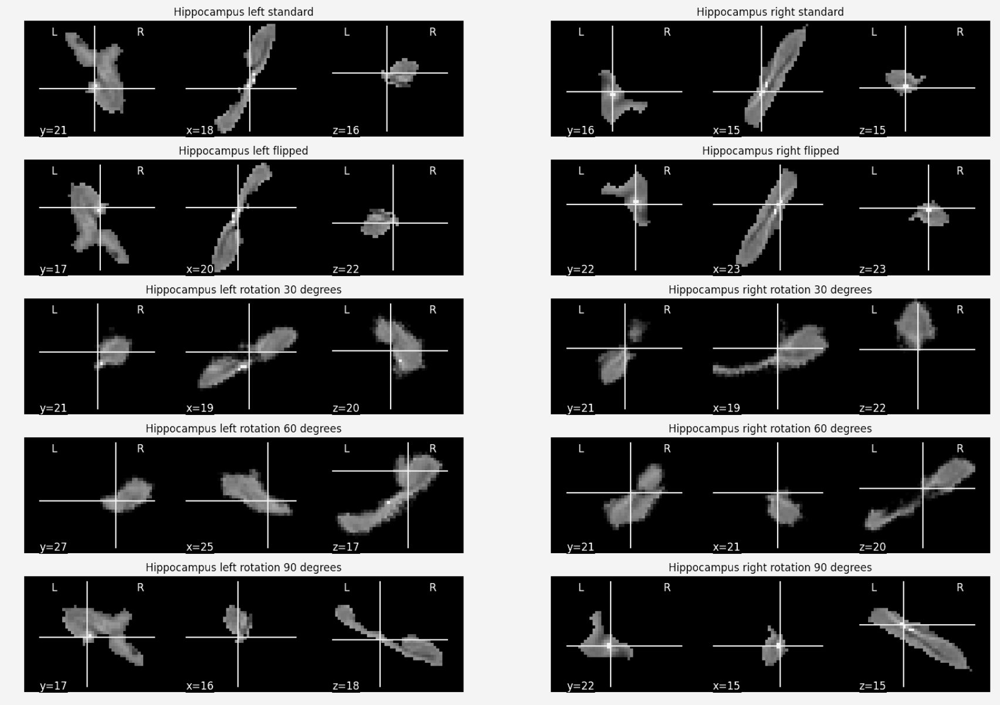
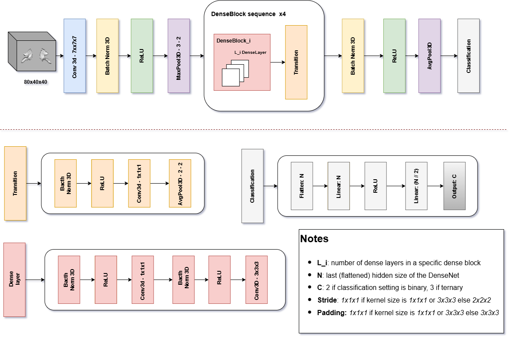
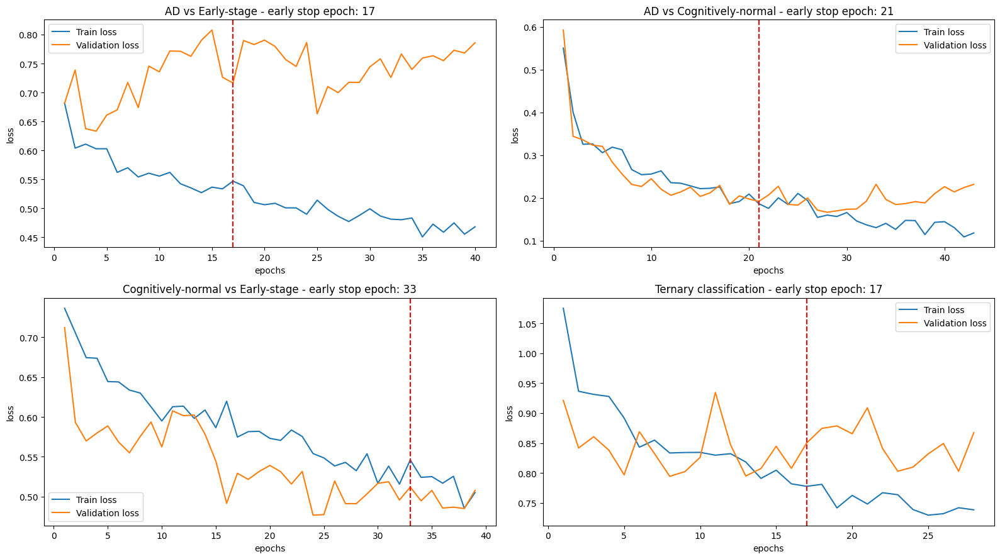
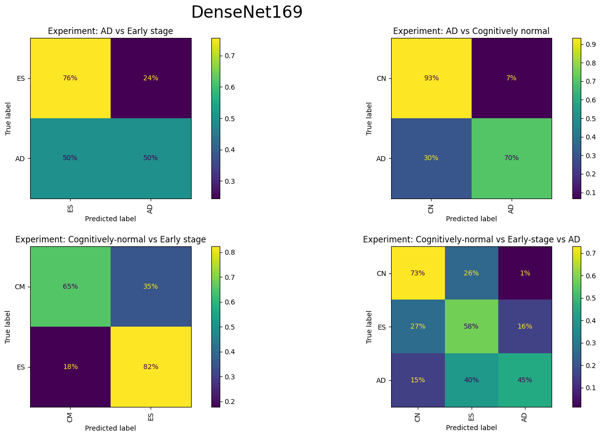
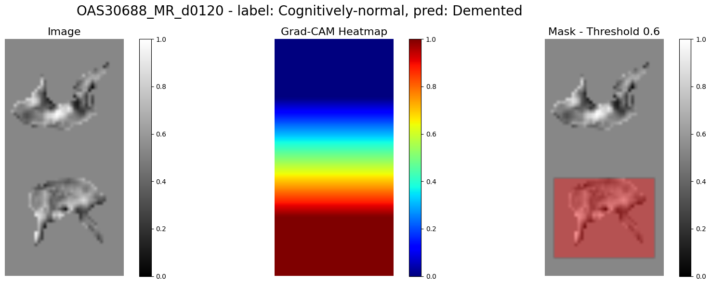

# Biomarker-Guided CNNs for Precision Detection of MCI in Alzheimer’s Disease

## Project overview
This project is structured as follow. Since its aim is mainly **experimental**, and due to hardware limitations (which led to model training in platform such as Kaggle) the strutcture is straight-forward:
- **scripts**: contains bash files to download the oasis dataset and to perform the session matchup as described [here](https://github.com/NrgXnat/oasis-scripts);
- **src**: source code with custom models and preprocessing logic
- **notebooks**: various experimentations on the dataset (download, preprocessing, hippocampus extraction, DeneNet training, GradCAM)
## AD consequences
- Progressive **cognitive decline** which lead to a **loss of autonomy**
- **Influence**: patient, family members and caregivers

## What this project is about
1. **Region of interest (ROI)** based deep learning approach: a deep learning model that can process the hippocampus MRI as input instead of the whole brain volume
2. **Ternary classification problem**: instead of simply classifying AD vs Cognitevely normal patients, another class, namely MCI or Early-Stage is added to the mix, which makes the AD detection problem extremely challenging
3. **XAI**: Implementation of a XAI technique, namely GradCAM, to check on what the model focuses during its predictions

## The chosen ROI
- One of the first physical symptoms of AD is known as "brain atrophy", which is basically a shrinkage of the brain volume
- The **hippocampus** is one of the first brain areas to exhibit such phenomena

## Proposed pipeline

*Figure 1: The proposed workflows shows the pipeline of operations employed in this work.*

## Dataset
Open Access Series of Imaging Studies (OASIS) version 3: a project aimed at making neuroimaging datasets freely available to the scientific community.
This dataset contains:
- MRI scans at different level of contrast 
- PET scans
- CT scans
- Assessments made with Freesurfer
- Metadata (consisiting of CSV files, useful to pre-process the labels and align them)

<table border="1" cellspacing="0" cellpadding="6">
  <tr>
    <th>State</th>
    <th>Number of subjects</th>
  </tr>
  <tr>
    <td><strong>Cognitive Normal (CN)</strong></td>
    <td>755</td>
  </tr>
  <tr>
    <td><strong>Cognitive decline (AD)</strong></td>
    <td>622</td>
  </tr>
  <tr>
    <td><strong>Total</strong></td>
    <td>1377</td>
  </tr>
</table>

## Preprocessing
The preprocessing involved: 
1. **Label correction**: avoid situations in which a patient at a given time $t$ is affected with dementia and at $t+1$ is "magically" healthy again 

*Figure 2: Example of label correction. An MRI for patient OAS30194 is positive (AD) around $t$ 7500 but turns out to be negative (CN) around $t$ 9000 and then again positive. The right picture shows a fixed version for the labels associated to the MRI of the same subject.*

2. **Random undersampling for majority class**: random undersampling over the CN class to avoid class imbalance

#### Before resampling
<table border="1" cellspacing="0" cellpadding="6">
  <tr style="background-color: #00A391; color: white; font-weight: bold;">
    <th>Label</th>
    <th>Number of subjects</th>
    <th>Class code</th>
  </tr>
  <tr>
    <td>Cognitive normal</td>
    <td>1892</td>
    <td>CN</td>
  </tr>
  <tr>
    <td>Early-stage</td>
    <td>368</td>
    <td>ES</td>
  </tr>
  <tr>
    <td>Demented</td>
    <td>119</td>
    <td>AD</td>
  </tr>
</table>

#### After resampling
<table border="1" cellspacing="0" cellpadding="6">
  <tr style="background-color: #00A391; color: white; font-weight: bold;">
    <th>Label</th>
    <th>Number of subjects</th>
    <th>Class code</th>
  </tr>
  <tr>
    <td>Cognitive normal</td>
    <td>550</td>
    <td>CN</td>
  </tr>
  <tr>
    <td>Early-stage</td>
    <td>368</td>
    <td>ES</td>
  </tr>
  <tr>
    <td>Demented</td>
    <td>119</td>
    <td>AD</td>
  </tr>
</table>

 

3. **Hippocampus extraction**: using FastSurfer CNN

*Figure 3: the overall architecture of the FastSurfer CNN used to extract the hippocampus from the raw T1W MRI*

4. **Data augmentation and subject wise splitting**: each split is made up of 400 samples with the addition of syntetically generated instances through rotations and flippings

*Figure 4: various types of augmentations performed on the left and right hippocampus. Note that to achieve consistency the same transform is applied to both hippocampus of a same scan.*

## Classification model
- **DenseNet**: feature extraction model
- **MLP**: as a classification head

*Figure 5: a DenseNet model. Note that the number of dense layer changes according to the network complexity (121, 169, 201, 264).*

## Experiments

- 4 experiments: all class combinations with four variants of the DenseNet model (121, 169, 201, 264)
- Training on NVIDIA TESTLA P100 GPU

### Hyperparameters
- 100 epochs
- Early stopping (activated after the 10 epochs)
- Adam optimizer with 5e-5 as initial learning rate
- Cosine annealing scheduler
- 1e-2 weight decay
- 0.1 dropout

## Results on DenseNet169

<table border="1" cellpadding="8" cellspacing="0" style="border-collapse: collapse; text-align: center;">
    <tr style="background-color: #00A391; color: white; font-weight: bold;">
      <th>
Task
</th>
      <th>Precision</th>
      <th>Recall</th>
      <th>F1</th>
      <th>Accuracy</th>
      <th>AUC</th>
    </tr>
    <tr>
      <td><strong>CN vs AD</strong></td>
      <td>0.828</td>
      <td>0.816</td>
      <td>0.822</td>
      <td>0.883</td>
      <td>0.816</td>
    </tr>
    <tr style="color: red;">
      <td><strong>ES vs AD</strong></td>
      <td>0.624</td>
      <td>0.628</td>
      <td>0.626</td>
      <td>0.677</td>
      <td>0.628</td>
    </tr>
    <tr>
      <td><strong>CN vs ES</strong></td>
      <td>0.722</td>
      <td>0.735</td>
      <td>0.712</td>
      <td>0.714</td>
      <td>0.735</td>
    </tr>
    <tr style="color: red;">
      <td><strong>CN vs ES vs AD</strong></td>
      <td>0.601</td>
      <td>0.586</td>
      <td>0.591</td>
      <td>0.640</td>
      <td>0.773</td>
    </tr>
  </table>

### Learning curves

*Figure 6: plot of learning curvers of DenseNet-169 over the four classification tasks.*

### Confusion matrix

*Figure 7: plot of confusion matrix of DenseNet-169 over the four classification tasks.*

### Gradcam

*Figure 8: example of GradCAM heatmap.*

### Comments
1. The **hippocampus** is a very small area of the brain. Nevertheless in the binary classification AD vs CN the model shows good performances in the task of separating the two classes
2. The **ternary classification setting** is the real issue, since the introduction of ES scans let the model to show irregular behaviors like the learning curves and confusion matrix display
3. Finally the **GradCAM** shows that the model tend to focus only on one of the two hippocampi, limiting the performances

## Useful papers
This project was built during my master's thesis in data science in the field of deep learning. Here there are a few notable papers that I consulted during this journey:

- [Densely Connected Convolutional Networks (Gao Huang, Zhuang Liu, Laurens van der Maaten, Kilian Q. Weinberger)](https://arxiv.org/abs/1608.06993)
- [Grad-CAM: Visual Explanations from Deep Networks via Gradient-based Localization (Ramprasaath R. Selvaraju, Michael Cogswell, Abhishek Das, Ramakrishna Vedantam, Devi Parikh, Dhruv Batra)](https://arxiv.org/abs/1610.02391)
- [FastSurfer -- A fast and accurate deep learning based neuroimaging pipeline (Leonie Henschel, Sailesh Conjeti, Santiago Estrada, Kersten Diers, Bruce Fischl, Martin Reuter)](https://arxiv.org/abs/1910.03866)
